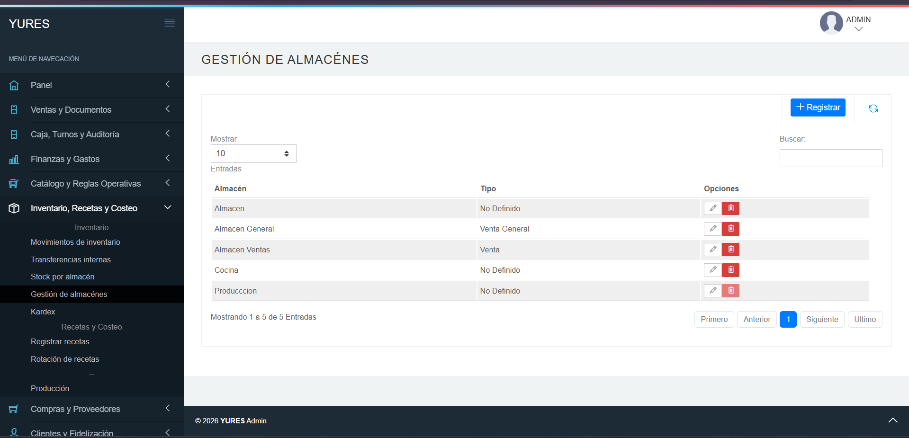

# 6.1 Cómo gestionar almacenes en YURES

## Ruta
Inventario, Recetas y Costeo → Inventario → Gestión de almacenes

## Objetivo
Registrar, editar y eliminar almacenes desde la tabla de gestión.

## Precondiciones
- Tener acceso al módulo de inventario.

## Pasos
1. Ingresar a **Inventario, Recetas y Costeo → Inventario → Gestión de almacenes**.
2. Hacer clic en **+ Registrar**, escribir la **Descripción**, seleccionar un **Tipo** y hacer clic en **Guardar**.
3. Para editar un almacén, hacer clic en el ícono de **lápiz**, actualizar **Descripción** o **Tipo** y hacer clic en **Guardar**.
4. Para eliminar un almacén, hacer clic en el ícono de **papelera** y confirmar en el mensaje **¿Realmente desea eliminar este almacén?** con **Aceptar**.
5. Verificar en la tabla que el almacén se haya creado, actualizado o eliminado.

## Resultado esperado
- La tabla de **Gestión de almacenes** refleja los cambios realizados.
- Los almacenes quedan disponibles según su registro y tipo seleccionado.

## Capturas

## Siguiente tema
[6.2 Cómo consultar stock por almacén](6.2-consultar-stock-por-almacen.md)

