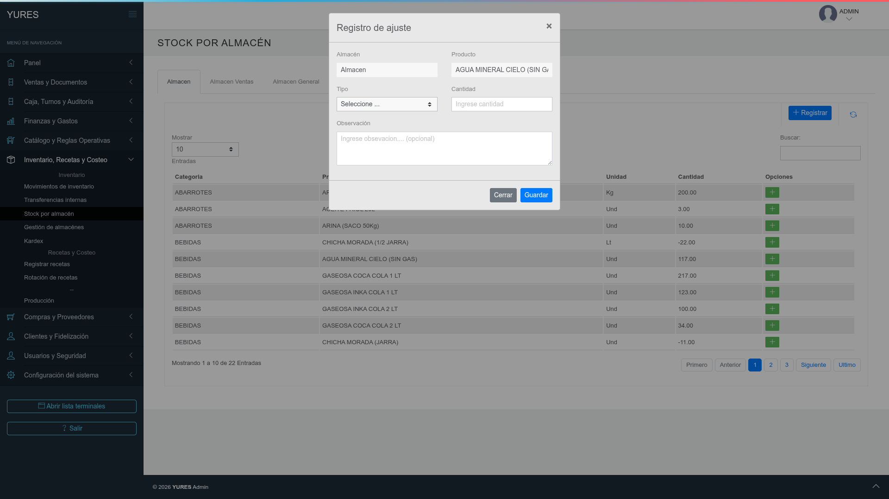
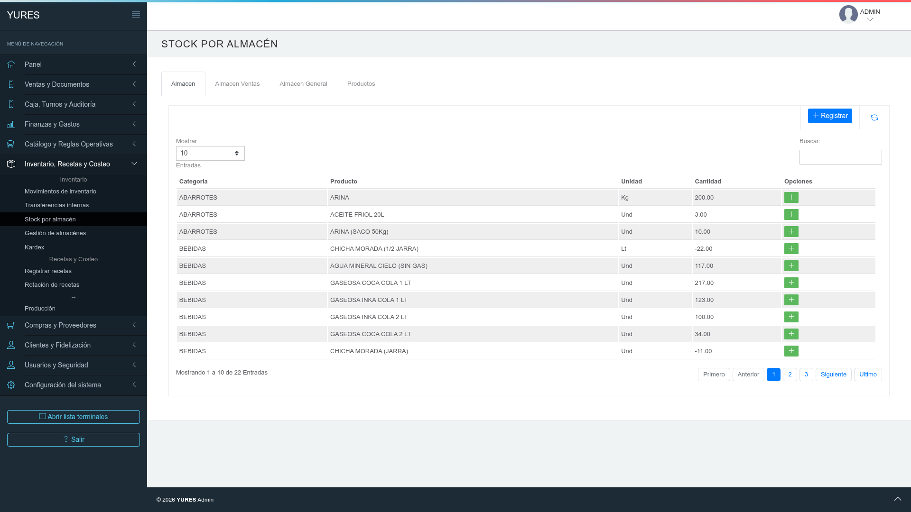

# 6.4 Cómo realizar ajustes de inventario (ingresos y salidas) en YURES

### Ruta
Inventario, Recetas y Costeo → Movimientos de inventario.

### Objetivo
Registrar un ajuste de ingreso o salida de stock con motivo para mantener trazabilidad.

### Precondiciones
- Tener el producto registrado en el sistema.
- Contar con permisos para registrar movimientos de inventario.
- Definir el almacén y el motivo del ajuste antes de registrar.

### Pasos
1. Ingrese a **Inventario, Recetas y Costeo** y abra **Movimientos de inventario**.
2. Seleccione la acción **Ajuste** para crear un nuevo movimiento.
3. Elija el tipo de ajuste (**Ingreso** o **Salida**) y el **almacén** donde se aplicará.
4. Complete **producto**, **cantidad** y **motivo** del ajuste.
5. Guarde el movimiento y verifique el registro en el listado de movimientos.

### Resultado esperado
- El ajuste queda registrado con fecha, usuario, almacén, producto y motivo.
- El stock del producto se actualiza según el tipo de ajuste.

### Capturas
???+ info "Capturas (referencia visual)"
    | | |
    |---|---|
    |  |  |

### Siguiente tema
[6.5 Cómo generar el reporte de movimientos de productos](6.5-generar-el-reporte-de-movimientos-de-productos.md)
