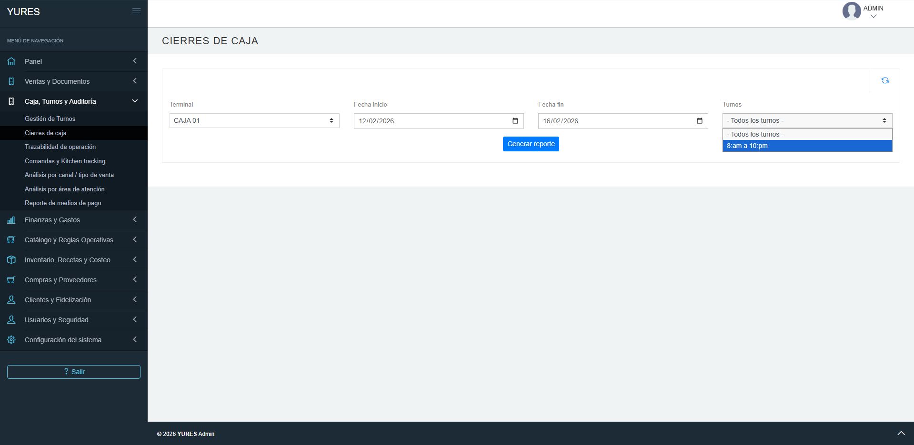
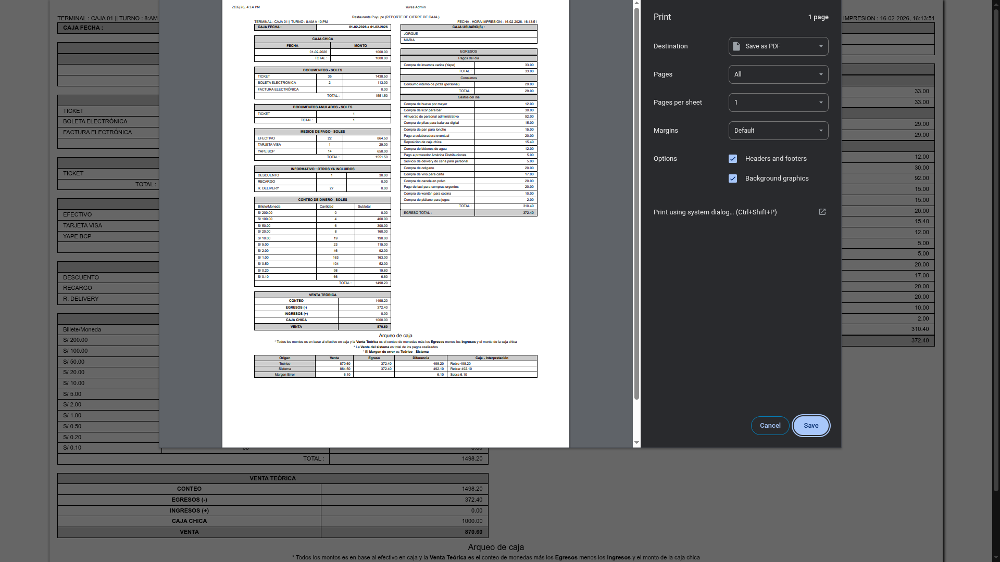
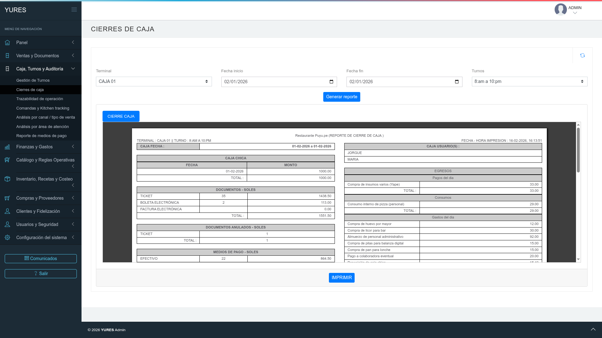

# 1.1 Cómo leer el reporte de cierre de caja en YURES

## Ruta
Caja, Turnos y Auditoría → Cierres de caja

## Objetivo
Cómo Generarar e intepretar el reporte de cierre de caja en YURES

## Precondiciones
- Contar con permisos para acceder a los reportes de cierre.
- Disponer de cierres de caja generados previamente.

## Pasos
1. Navegar al módulo **Caja, Turnos y Auditoría** y seleccionar la opción **Cierres de caja**.
2. Seleccionar la **caja** y definir el rango de fechas del cierre a consultar.
3. Aplicar los filtros para generar el reporte del periodo.
4. Verificar los totales por medios de pago y el total general del cierre mostrado.
5. Hacer clic en **Imprimir reporte** para emitir el reporte validado.

## Resultado esperado
- El reporte de cierre de caja se muestra según los filtros aplicados.
- El usuario imprime el reporte para control operativo.
- **Claves de lectura:**
  - Verifique que la caja y el rango de fechas del encabezado coincidan con el turno que desea cerrar.
  - Compare el total general del reporte con la suma de los medios de pago mostrados.
  - Revise que no existan montos en cero o medios de pago faltantes frente al movimiento real del turno.
  - Si detecta diferencias, vuelva a filtrar el periodo correcto antes de imprimir para evitar cierres erróneos.

## Capturas
!!! info "Capturas (referencia visual)"

    |   |   |
    |---|---|
    |  |  |
    |  | |

## Siguiente tema
[1.2 Cómo diagnosticar cuando no cuadra caja en YURES](1.2-diagnosticar-cuando-no-cuadra-caja.md)
